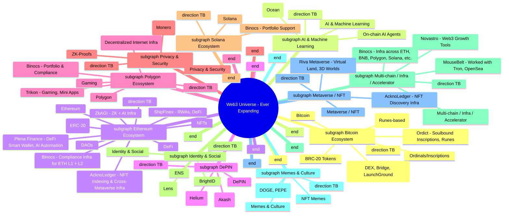

## Hi there 👋

## 👋 About Me

I help Web3 brands get **noticed**—no jargon, no empty promises. It’s all about smart marketing, stories folks remember, and a community that gives a damn.

If you’re looking for more than standard solutions, I’d be glad to help. I approach every project with care, honest advice, and a focus on strategies that truly suit your goals. Let’s work together to create momentum that makes a real difference.

I’ve:
- **Educated 10,000+ students** on blockchain & crypto fundamentals as an independent Web3 educator/mentor.
- Helped learners land roles at top Web3 firms—Kraken, Mina, Polygon, and more.
- Became a go-to for Web3 upskilling and education, shaping careers and communities.
- At **ORDICT** (Marketing Team Lead), sparked engagement with 40K+ campaign participants and managed $10K influencer airdrop budgets.
- At **TRIKON** (Marketing Manager), took Twitter & Telegram from 6K to 100K+ followers, built 300+ partnerships, and delivered 50K+ active Mini App users.
- Drove audience gains and digital presence in all the projects I joined.
- At **BINOCS**, brought in 20K+ user signups across India, US, UK in 6 months; grew Twitter from 500 to 15K+ followers, all organic.
- Handled SEO, ads, and conversion optimization for a leading crypto tax platform.
- Delivered results for multiple blockchain clients at **CoinQue Consulting** with tailored marketing.
- Supported global blockchain education as **MouseBelt CTO Executive Assistant & Marketing Associate**—collaborating with 100+ universities in over 20 countries.
- **Generated high-value leads** for a blockchain trainer, connecting with industry leaders including **NPCI, Dell, and other Fortune 500 companies** seeking workshops and upskilling sessions.

> Let’s face it: Web3 is full of noise. You want results? Get the right story, the right crowd, and a strategy that cuts through—otherwise, it’s all just vapour.

## 🚀 Clients & Partners

  
  
  
  
  
  
  

## 🔧 Web3 Distribution Ally Toolbox

| Toolbox Area                  | Key Tools & Platforms (Summary)                                   |
|------------------------------|------------------------------------------------------------------|
| **Cross-Promotional Campaigns** | Galxe, Zealy, Layer3, QuestN, Crew³, Noox, Premint, Dework, Tropee |
| **Rewards & Incentives**       | CoinMarketCap Earn, Galxe, Layer3, RabbitHole, QuestN, KuCoin Spotlight, POAP, Gitcoin |
| **Community Bridging**         | Discord, Telegram, Farcaster, Lens, Guild.xyz, Collab.Land, Shieldy, Karma |
| **Distribution Analytics**     | Dune Analytics, Cookie3, Nansen, Safary, The Graph, Token Terminal, Flipside Crypto, Messari |
| **Social Amplification**       | Hootsuite/Buffer, TweetHunter, TweetDeck, Mirror.xyz, LunarCRUSH, Brandwatch |
| **Partner & Influencer Activation** | Rizely, Upfluence, AspireIQ, Tropee, Brandwatch, Notion, HubSpot, CreatorIQ |
| **Automation & AI**            | Zapier, Make (Integromat), GPT-4, Jasper, GitHub Actions, Custom Bots |
| **Gamification**               | Zealy, Layer3, QuestN, Noox, RabbitHole, Project Galaxy, Arcade.xyz |
| **Metaverse & Events**         | Decentraland, Spatial, Gather.town, Zoom, Livepeer, POAP, Mintgate |
| **DAO & Governance**           | Snapshot, Aragon, Juicebox, Tally.xyz, Gnosis Safe, Coordinape, DAOhaus |

                                    

### My Journey in Web3 

